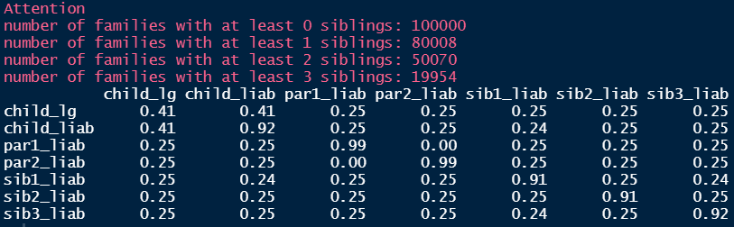
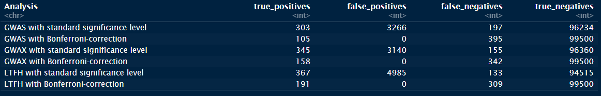
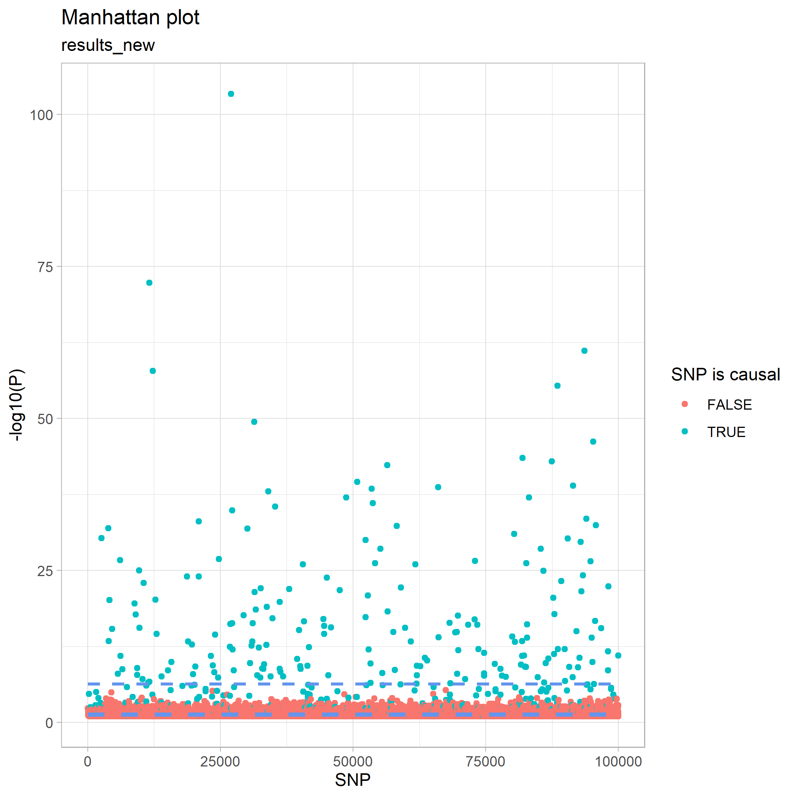
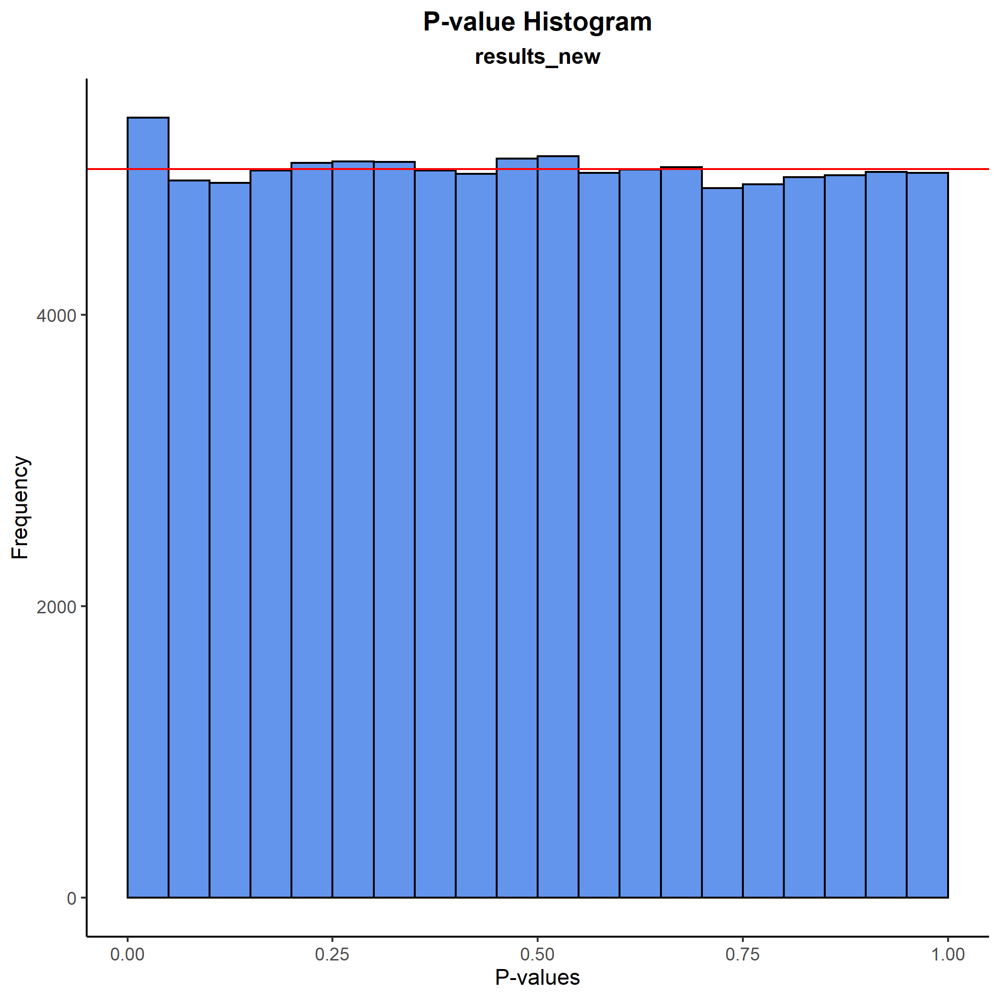
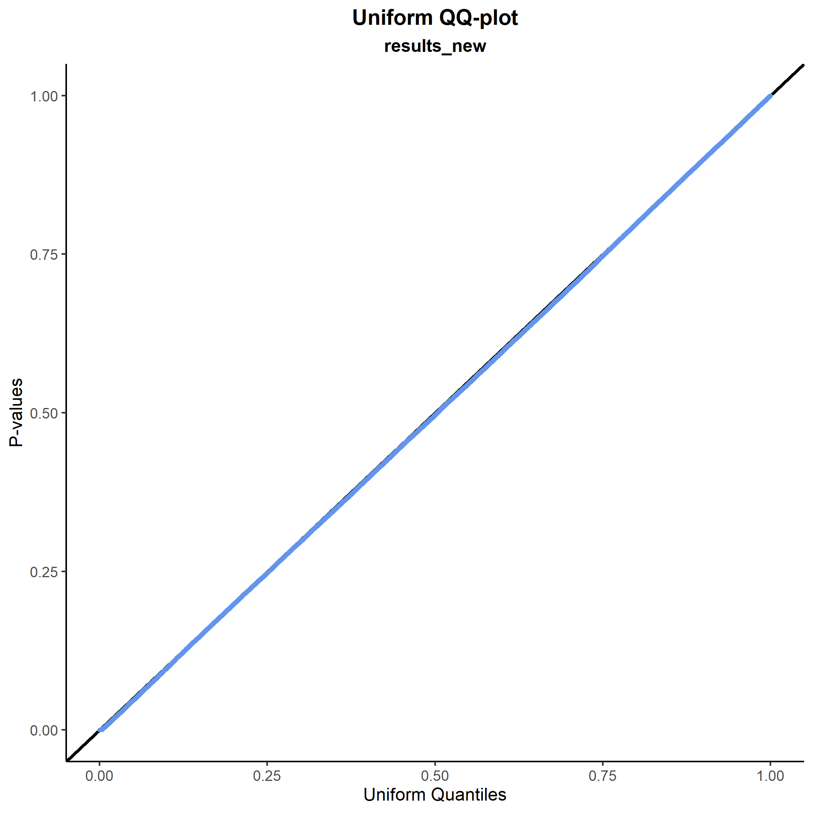
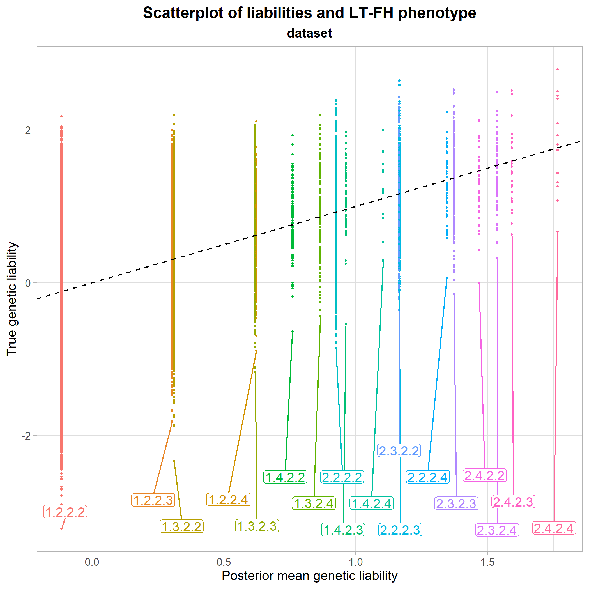
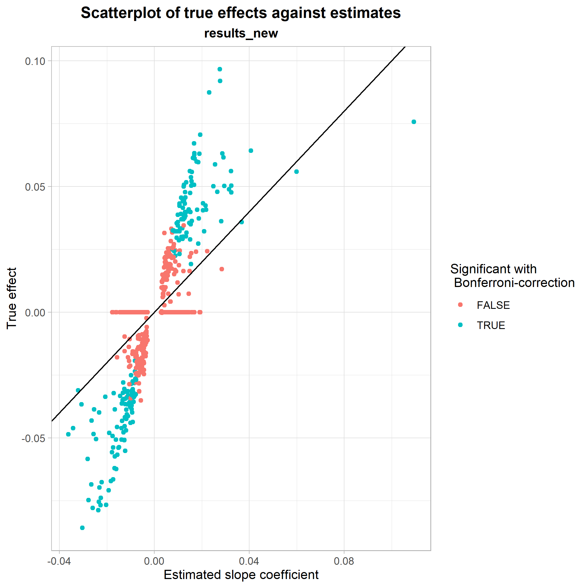

```{r, include = FALSE}
knitr::opts_chunk$set(
  collapse = TRUE,
  comment = "#>"
)
```

In this vignette, we show a very brief example of how one might use the functionalities implemented in geneference to simulate, analyse and visualise genetic data.

# Simulation
geneference comes shipped with several simulation functions relying on assumptions outlined in `vignette("liability-distribution")`. The general setup for all simulation functions except `sim_test()` is that they write to disk.  
We can, however, use `sim_test()` to get an idea of how our framework of genotype data looks, directly in R:

```{r}
library(geneference)
test_data <- sim_test(n = 10, m = 10, q = 2, hsq = 0.5, k = 0.05, to_ped = FALSE)
test_data[[1]]
```
Each row denotes a genotype and each column a SNP, where the entries represent the number of minor alleles.  
`sim_test()` also allows the user to get a glimpse of liabilities, effect sizes, and phenotype status.  
However, as the other simulation functions are implemented with intent to simulate larger datasets, we use another framework for representing some of the data, such that we can use the software PLINK to handle the data efficiently.  
This can also be shown with `sim_test()`, setting `to_ped = TRUE`:
```{r}
test_data <- sim_test(n = 10, m = 10, q = 2, hsq = 0.5, k = 0.05, to_ped = TRUE)
test_data[[1]]
```
The first 6 columns are to satisfy PLINK's input, while the rest of the columns are still SNPs; instead denoted with allelic letters.

In this vignette, we use `sim_random_family()` to generate a realistic dataset with varying family sizes. We decide on a distribution and a maximum of 3 siblings in a family:
```{r, eval=FALSE}
dirpath <- "C:\\Users\\Bruger\\OneDrive - Aarhus universitet\\GWAS\\Data\\IntroData\\"
sim_random_family(n = 100000,
                  m = 100000,
                  q = 500,
                  hsq = 0.5,
                  k = 0.05,
                  sib_fert = c(0.2,0.3,0.3,0.2),
                  dist = c(0,1,2,3),
                  path = dirpath)

# converting genotypes data in order to save storage space
pedfile <- "C:\\Users\\Bruger\\OneDrive - Aarhus universitet\\GWAS\\Data\\IntroData\\genotypes"
convert_geno_file(pedfile, del = T, plink_path = T)
```
After running the simulation and converting genotypes.ped and genotypes.map, we now have 6 files in our directory. These consist of genotype data, phenotype data, effect sizes used in the simulation, minor allele frequencies used in the simulation and a few files to satisfy PLINK's input conditions.

# Analysis
The next step is to create some of the more refined phenotypes than the standard binary case-control representation in the simulation. We do this by two function calls:
```{r, eval=FALSE}
phenopath <- paste0(dirpath,"phenotypes.txt")
outfile <- paste0(dirpath,"phenoRefined.txt")
assign_ltfh_phenotype(pheno_file = phenopath,output_file = outfile, alpha = 0.05)
assign_GWAX_phenotype(pheno_file = outfile)
```
The assigners work by appending new columns to the end of the phenotypes file. The assignment of the LT-FH phenotype results in three new columns, two of them detailing information about family configurations and the last one containing the posterior mean genetic liability of each configuration. For details about how we sample liabilities, see `vignette("gibbs")`.  
The assignment of GWAX phenotype only yields one new column; namely GWAX_pheno.

After having assigned the relevant phenotypes, we call PLINK to perform the analysis:
```{r, eval=FALSE}
genofile <- paste0(pedfile,".bed")
analysis_association(geno_file = genofile, pheno_file = outfile, pheno_name = "LTFH_pheno", out_dir = dirpath)
analysis_association(geno_file = genofile, pheno_file = outfile, pheno_name = "GWAX_pheno", out_dir = dirpath)
analysis_association(geno_file = genofile, pheno_file = outfile, pheno_name = "pheno", out_dir = dirpath)
```
We now have results from three different association studies on the same dataset, but with different representations of the phenotype.  
From here on out, we can load the data into R, such that we can begin investigating the results of the analyses.  
geneference has two loading functions: One for loading phenotype data, and one for loading and merging everything else:
```{r, eval=FALSE}
phenodata <- load_phenotypes(outfile)
results <- load_results(dirpath)
results_new <- augment_results(data = results, alpha = 0.05)
```
We augment results to obtain columns denoting relevant information for plotting (logical columns specifying which tests were significant and which SNPs are truly causal).  
For a start, let's see if the distribution of the liabilities in the families seem to follow the theoretical model.  
Firstly, we use `covmatrix()` to get the theoretical covariance matrix:
```{r}
covmatrix(0.5, 3)
```
We compare this to the empirical covariance matrix of liabilities:
```{r, eval=FALSE}
calculate_cov(pheno = phenodata)
```

Some of the liabilities are a little lower than what we would expect, but most seem fine.  
Let's look at how the models performed with regards to error types of the tests, i.e. how well they found the truly causal SNPs:
```{r, eval=FALSE}
Errortypes <- calculate_error_types(causal = results_new$causal,
                                    significant = results_new$P_GWAS_significant,
                                    bonferroni = results_new$P_GWAS_bonferroni,
                                    analysis_name = "GWAS") %>% 
  tibble::add_row(calculate_error_types(causal = results_new$causal,
                                        significant = results_new$P_GWAX_significant,
                                        bonferroni = results_new$P_GWAX_bonferroni,
                                        analysis_name = "GWAX")) %>% 
  tibble::add_row(calculate_error_types(causal = results_new$causal,
                                        significant = results_new$P_LTFH_significant,
                                        bonferroni = results_new$P_LTFH_bonferroni,
                                        analysis_name = "LTFH"))
Errortypes
```

We see that GWAX is better than the standard representation, but that the LT-FH phenotype outperforms both by quite a bit.  
This can be visualised by a Manhattan plot, where we see that we have no non-causal SNPs above the Bonferroni-corrected line, but unfortunately still have many causal SNPs below it.
```{r, eval=FALSE}
plot_manhattan(results_new, results_new$P_LTFH)
```


Some of the p-values in the Manhattan plot looked quite extreme, however, so let's do a sanity check and plot how they are distributed. We do this first with a histogram and next with a QQ-plot:
```{r, eval=FALSE}
plot_pval_hist(results_new, results_new$P_LTFH)
```


```{r, eval=FALSE}
plot_pval_QQ(results_new, results_new$P_LTFH)
```

As expected, both plots tell the same story: The p-values are fine.

Instead, we can try to get a better idea of the intuition behind why the LT-FH method performs so well. Since we have varying family sizes in our data, we have a lot of equivalent family configurations. So, for clarity in the following plot, we instead use a dataset where the family size is fixed at 2 siblings.  
We plot the true genetic liabilities against the posterior mean genetic liabilites:
```{r, eval=FALSE}
plot_pmgl_vs_true(phenodata)
```

From this, it seems clear that the mean of the true genetic liabilities are being estimated accurately by LT-FH, as the center of each configuration class is approximately at the identity line. So, in short, the LT-FH method enables us to come much closer to the true liability of an individual than simply using their own phenotype status.  
The plot also makes it possible to compare different configuration classes to each other. For instance, we see that the configuration class 1.2.2.3 and the class 1.3.2.2 lie very close to each other, meaning that having only one sibling or only one parent who is case, has approximately the same influence on an individual's estimated genetic liability. The final section of `vignette("liability-distribution")` further details how to read the configuration classes.

Finally, we look at a scatterplot of true effect sizes against estimated effect sizes from the regression with LT-FH. Here, it is shown how well the LT-FH method estimates true effect sizes and whether or not there are any noticable patterns in its estimations.
```{r, eval=FALSE}
plot_estimates_vs_true(dataset = results_new, BETA = results_new$BETA_LTFH, P = results_new$P_LTFH, bonferroni = results_new$P_LTFH_bonferroni, true_effect = results_new$beta)
```

This was a showcase of some of the functionalities implemented in genference. For a full list of exported functions, see the [package documentation](https://firegutter.github.io/geneference/reference/index.html).
